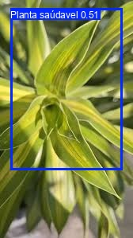
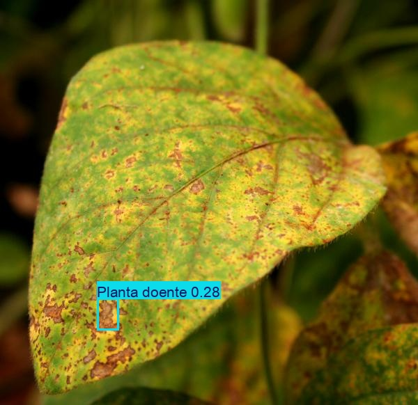
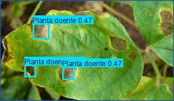
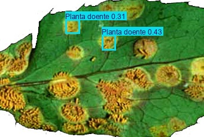

# FIAP - Faculdade de Informática e Administração Paulista


# O Despertar da Rede Neural

## 👨‍🎓 Integrantes
- [CAUAN OTTO RODRIGUES SOUSA (RM567940)](https://www.linkedin.com/in/cauanotto)
- [FERNANDO A GURGEL (RM567606)](https://www.linkedin.com/in/fernando-gurgel-75aa8369)
- [IRACI MONTEIRO SOUZA (RM567544)](https://www.linkedin.com/in/iraci-souza-bab42034)
- [MARIA LUISA RODRIGUES NASCIMENTO (RM567659)](https://www.linkedin.com/in/malu-rodrigues-bb756b271)
- [RAFAELA TORRES MARTINS (RM567735)](https://www.linkedin.com/in/rafaela-torres222)

## 👩‍🏫 Professores
- **Tutor(a):** [ANA CRISTINA DOS SANTOS](https://www.linkedin.com/company/inova-fusca)
- **Coordenador(a):** [ANDRÉ GODOI](https://www.linkedin.com/in/andregodoichiovato)

---

## 📌 Contexto

A **FarmTech Solutions**, empresa de tecnologia voltada ao agronegócio, está expandindo sua atuação para a área de **visão computacional**. Um cliente do setor agrícola procurou a empresa com uma necessidade crítica: a **detecção precoce de doenças em plantações**, que hoje é feita manualmente — um processo lento, sujeito a falhas e com altos custos operacionais.

Este projeto foi desenvolvido como **prova de conceito (PoC)** para demonstrar ao cliente a viabilidade de um sistema automatizado de detecção baseado em redes neurais, capaz de analisar imagens de plantas e identificar sinais de doença.

O trabalho foi dividido em **duas entregas**:

- **Entrega 1:** sistema de detecção com **YOLOv5** (transfer learning), comparando duas configurações de treinamento (30 e 60 épocas).
- **Entrega 2:** comparação crítica entre **YOLO Adaptável**, **YOLO Tradicional (zero-shot)** e **CNN treinada do zero**.

---

## 🎯 Objetivo

Avaliar arquiteturas de visão computacional capazes de identificar plantas saudáveis vs. plantas doentes, e determinar qual abordagem é mais adequada para implantação em campo, considerando precisão, tempo de treinamento, tempo de inferência e facilidade de integração.

---

## 📊 Dataset 

A base de imagens foi coletada e rotulada manualmente via [MakeSense.ai](https://www.makesense.ai/), seguindo o formato de anotação YOLO (bounding boxes com coordenadas normalizadas).

| Classe | Treino | Validação | Teste (Inéditas) | Total |
|--------|--------|-----------|------------------|-------|
| Planta Saudável (Classe A) | 74 | 5 | 4 | 83 |
| Planta Doente (Classe B) | 50 | 5 | 4 | 59 |
| **Total** | **124** | **10** | **8** | **142** |

> ⚠️ As imagens de **validação e teste são inéditas** — não foram utilizadas durante o treinamento, evitando overfitting e garantindo uma avaliação realista do modelo.

**Link do dataset:** [Google Drive](https://drive.google.com/drive/folders/12rNWw6JFQgN4MIsqNE8bFzhTBLGkdEbG?usp=drive_link)

### Estrutura de pastas no Google Drive

```
FIAP/
├── images/
│   ├── train/      (124 imagens: 74 saudáveis + 50 doentes)
│   ├── val/        (10 imagens: 5 saudáveis + 5 doentes)
│   └── test/       (8 imagens inéditas: 4 saudáveis + 4 doentes)
├── labels/
│   ├── train/      (arquivos .txt com bounding boxes)
│   └── val/        (arquivos .txt com bounding boxes)
└── plantas.yaml    (configuração do dataset para o YOLOv5)
```

---

# 📦 ENTREGA 1 — YOLO Adaptável com Transfer Learning

## ⚙️ Metodologia

1. **Coleta e Rotulação:** imagens organizadas e rotuladas no [MakeSense.ai](https://www.makesense.ai/), gerando arquivos `.txt` no formato YOLO (classe, x_centro, y_centro, largura, altura).
2. **Treinamento:** modelo **YOLOv5s** (small) com **transfer learning** a partir dos pesos pré-treinados no COCO (`yolov5s.pt`), executado no Google Colab com GPU T4.
3. **Comparação:** duas execuções com parâmetros idênticos, variando apenas o número de épocas (**30 e 60**), para avaliar o impacto na acurácia, conforme exigido no enunciado.
4. **Validação:** métricas formais (Precision, Recall, mAP@0.5, mAP@0.5:0.95) calculadas via `val.py` sobre o conjunto de validação, usando o `best.pt` de cada treino.
5. **Teste:** inferência sobre **8 imagens totalmente inéditas** com `detect.py` para demonstrar capacidade de generalização ao cliente.

### Hiperparâmetros do treinamento

| Parâmetro | Valor |
|-----------|-------|
| Modelo base | YOLOv5s (`yolov5s.pt`) |
| Tamanho da imagem | 640 × 640 |
| Batch size | 16 |
| Otimizador | SGD |
| Learning rate inicial | 0.01 |
| Momentum | 0.937 |
| Weight decay | 0.0005 |
| Warmup epochs | 3 |
| Data augmentation built-in | mosaic = 1.0, fliplr = 0.5 |

## 📈 Resultados — Entrega 1

Comparação de desempenho após o *fine-tuning* do modelo YOLOv5s, com métricas oficiais obtidas via `val.py` sobre o `best.pt` de cada treinamento:

| Métrica | 30 Épocas | 60 Épocas | Tendência |
|---------|-----------|-----------|-----------|
| Precision | 0.282 | 0.217 | ↓ |
| Recall | 0.487 | 0.438 | ↓ |
| **mAP@0.5** | 0.338 | **0.339** | ≈ estável |
| **mAP@0.5:0.95** | 0.150 | **0.192** | ↑ +28% |
| Tempo de treinamento | ~6 min | ~9 min | — |

🏆 **Modelo final selecionado: 60 épocas** (melhor mAP@0.5 e localização mais precisa).

### Exemplos de detecção

Exemplos de detecção:






### Análise da comparação 30 vs 60 épocas

- O **mAP@0.5** permaneceu praticamente estável (0.338 → 0.339), indicando que o modelo já havia atingido seu plateau de detecção genérica nas primeiras 30 épocas.
- O **mAP@0.5:0.95** subiu de 0.150 para 0.192 (+28%), revelando que as 30 épocas adicionais melhoraram significativamente a **precisão de localização** das bounding boxes em diferentes níveis de IoU. Esse é um ganho qualitativo importante: o modelo continua encontrando os objetos, mas agora os delimita melhor.
- A **Precision** e o **Recall** apresentaram ligeira queda, sugerindo o início de leve overfitting — o modelo ficou mais "conservador" nas predições. Esse padrão é coerente com um dataset pequeno e desbalanceado.
- A **classe "Planta saudável"** é detectada com mais facilidade (Precision e Recall consistentemente maiores), enquanto a **classe "Planta doente"** apresenta forte dificuldade — fato confirmado pela matriz de confusão (a maioria das doentes é confundida com background).

### Tempo de inferência

Tempo médio observado no `detect.py` sobre as 8 imagens de teste:

- Pre-process: 0.6 ms/imagem
- **Inferência: ~22 ms/imagem**
- NMS (Non-Maximum Suppression): 18 ms/imagem

Esse tempo viabiliza aplicações em **tempo real** (câmeras em drones agrícolas, ESP32-CAM em estufas).

## 🧪 Conclusões — Entrega 1

**Pontos fortes:**
- O **YOLOv5** demonstrou capacidade de detectar plantas doentes mesmo com um dataset reduzido.
- O **transfer learning** foi essencial para convergência rápida com poucos dados de treino.
- O tempo de inferência (~22 ms por imagem) viabiliza aplicações em **tempo real**.
- A separação rigorosa entre treino, validação e teste garante a confiabilidade das métricas.
- O treinamento é rápido (~9 minutos para 60 épocas em GPU T4), permitindo iterações ágeis.

**Limitações identificadas:**
- Dataset pequeno (142 imagens no total) restringe a robustez em cenários reais variados.
- Forte desbalanceamento de variabilidade entre classes: a classe "doente" apresenta manifestações muito heterogêneas (manchas, fungos, ferrugens), enquanto "saudável" é mais homogênea.
- Pouca variabilidade de condições de iluminação e ângulos.
- Ausência de técnicas customizadas de *data augmentation* além do padrão do YOLOv5.

### 📓 Notebook — Entrega 1

📔 [Acessar no Google Colab](https://colab.research.google.com/drive/1h3FO7aenvSVseIK1gm8VwoWGXvFAxCcs?usp=sharing)

> O notebook contém células de código executadas, células de markdown documentando todas as etapas e a análise comparativa de 30 vs 60 épocas.

---

# 📦 ENTREGA 2 — Comparação de Abordagens

## 🔬 Objetivo da Entrega 2

Confrontar a **YOLO Adaptável** (Entrega 1) com duas abordagens alternativas para determinar a melhor solução para a FarmTech Solutions:

1. **YOLO Adaptável (Entrega 1):** YOLOv5 com fine-tuning no nosso dataset — **detecção de objetos**.
2. **YOLO Tradicional:** YOLOv3 pré-treinada no COCO (Capítulo 10 do material FIAP), sem customização — **detecção de objetos genéricos**.
3. **CNN do Zero:** rede convolucional construída manualmente (Capítulo 9 do material FIAP) — **classificação de imagens**.

## 🏗️ Abordagens Implementadas

### Abordagem 1 — YOLO Adaptável (recap da Entrega 1)
- **Tipo de tarefa:** detecção de objetos (localiza + classifica simultaneamente).
- **Treinamento:** fine-tuning com 30 e 60 épocas sobre `yolov5s.pt`.
- **Resultado:** mAP@0.5 = **0.339** (60 épocas).

### Abordagem 2 — YOLO Tradicional (zero-shot)
- **Tipo de tarefa:** detecção genérica (80 classes do COCO).
- **Treinamento:** nenhum (zero-shot, *plug-and-play*).
- **Resultado:** ao analisar nossas imagens de plantas, o modelo detectou **"diningtable" (56%)** e **"bowl" (95%)** — falhou em reconhecer a folhagem agrícola, pois as classes "planta saudável/doente" não existem no COCO.

### Abordagem 3 — CNN do Zero
- **Tipo de tarefa:** classificação de imagens (não localiza, apenas classifica).
- **Arquitetura:** Conv2D(16) → MaxPool → Conv2D(32) → MaxPool → Conv2D(64) → MaxPool → Flatten → Dense(64) → Dense(32) → Dense(2, softmax).
- **Resultado:** acurácia de **50.0%** no conjunto de teste, com forte viés (todas as imagens classificadas como "Saudáveis").

## 📊 Tabela Comparativa Final (Resultados Reais)

| Critério | YOLO Adaptável (E1) | YOLO Tradicional (COCO) | CNN do Zero |
|----------|---------------------|-------------------------|-------------|
| **Tipo de tarefa** | Detecção (Localiza + Classifica) | Detecção genérica | Classificação |
| **Treinamento necessário?** | Sim (*fine-tuning*) | Não (*zero-shot*) | Sim (do zero) |
| **Tempo de treinamento** | ~6 min (30ep) / ~9 min (60ep) | 0 min | 11.19 segundos |
| **Tempo de inferência** | ~22 ms/img | ~2674 ms/img (2.67s) | ~52.8 ms/img |
| **Precisão / Acurácia** | mAP@0.5 = 0.339 | N/A (classes erradas) | Acurácia = 50.00% |
| **Detecta plantas doentes?** | ✅ Sim | ❌ Não (viu mesa/tigela) | ✅ Sim (só classifica) |
| **Facilidade de uso** | Média (requer dataset rotulado) | Muito fácil (sem setup) | Média (requer labels) |
| **Adaptabilidade ao domínio** | ⭐⭐⭐⭐⭐ Excelente | ⭐ Péssima | ⭐⭐⭐ Boa |

## 🔍 Análise Crítica Comparativa

### 1. Facilidade de uso / Integração
- **YOLO Tradicional:** a mais simples (*plug-and-play*), basta baixar pesos e rodar. Provou-se, contudo, **inútil** para o problema da FarmTech, pois não reconhece classes customizadas.
- **YOLO Adaptável:** exige rotulação prévia e configuração via YAML, mas entrega exatamente o resultado esperado pelo cliente, com localização precisa.
- **CNN do Zero:** requer esforço manual de arquitetura e organização de pastas. Resolve apenas a classificação, sem indicar onde a doença está na folha.

### 2. Precisão do modelo
- **YOLO Adaptável:** apresentou o melhor equilíbrio, sendo capaz de distinguir as classes agrícolas com mAP@0.5 = 0.339 e localização precisa via *bounding boxes*. O salto de mAP@0.5:0.95 (0.150 → 0.192) entre 30 e 60 épocas mostra que o modelo aprendeu a localizar com mais precisão.
- **YOLO Tradicional:** sem utilidade para o domínio — ao processar nossas imagens, retornou rótulos como "diningtable" e "bowl", confirmando que modelos genéricos não atendem problemas específicos.
- **CNN do Zero:** obteve 50.0% de acurácia, mas a **matriz de confusão** revelou um forte **viés (bias)**: classificou corretamente todas as 4 plantas saudáveis, porém errou todas as 4 plantas doentes (falsos negativos). Isso indica que a rede aprendeu a "responder sempre saudável", o que é inaceitável para um sistema de diagnóstico em campo.

### 3. Tempo de treinamento e customização
- **YOLO Tradicional:** 0 min (sem treino — mas sem resultado útil).
- **CNN do Zero:** ~11 segundos (rede pequena e dataset reduzido).
- **YOLO Adaptável:** ~9 min para 60 épocas (mais pesado, mas com resultado superior).

### 4. Tempo de inferência (predição)
- **YOLO Adaptável:** ~22 ms/imagem — adequado para **monitoramento em tempo real** via câmeras ou drones.
- **CNN do Zero:** ~52.8 ms/imagem — rápida, mas só classifica.
- **YOLO Tradicional:** ~2674 ms/imagem — muito lenta, pois a YOLOv3 (Darknet) tem arquitetura mais pesada que a YOLOv5.

## 🧪 Conclusão Geral

Na Visão Computacional, **não existe uma solução universalmente melhor** — tudo depende do cenário de aplicação. Para o problema da FarmTech Solutions:

1. **A YOLO Adaptável é a única solução viável.** Combina capacidade de localização precisa da patologia (bounding box) com tempo de resposta adequado para uso em campo. É a única abordagem testada que atende os três requisitos do cliente: **detecta**, **localiza** e **roda em tempo real**.

2. **A CNN do Zero é uma alternativa acadêmica interessante**, mas sua sensibilidade ao desbalanceamento de dados e sua incapacidade de localização a tornam menos confiável para diagnósticos críticos em campo.

3. **A YOLO Tradicional é inadequada** para problemas de domínio específico — demonstra de forma clara a necessidade de customização via *transfer learning*.

> **Lição principal:** o transfer learning oferece o melhor equilíbrio entre esforço de customização e qualidade dos resultados, especialmente com datasets pequenos.

**Trabalhos futuros:**
- Expansão do dataset para 500+ imagens por classe, com variações de iluminação, ângulos e estágios de doença.
- Aplicação de *data augmentation* customizada (rotação, brilho, contraste, ruído).
- Testes com YOLOv8 ou YOLOv11 para comparação de arquiteturas.
- Implementação com ESP32-CAM para inferência em campo.

### 📓 Notebook — Entrega 2

📔 [Acessar no Google Colab](https://colab.research.google.com/drive/1VbfTGjOEqX12XvEHvUrjENbUaVGTJY5E?usp=sharing)

> O notebook contém a implementação completa das três abordagens, com código executado, métricas reais, gráficos comparativos e análise crítica em Markdown.

---

# 📋 Informações Gerais

## 🚀 Como Executar

### Requisitos
- Python 3.10+
- Google Colab com **GPU T4** habilitada (`Ambiente de execução > Alterar o tipo de ambiente de execução > T4 GPU`)

### Passos — Entrega 1
1. Abra o notebook da Entrega 1 no Google Colab.
2. Ative a GPU T4.
3. Monte o Google Drive para acessar a pasta `/MyDrive/FIAP/`.
4. Execute todas as células sequencialmente.
5. Os resultados são salvos em `yolov5/runs/`.

### Passos — Entrega 2
1. Certifique-se de que a Entrega 1 foi concluída e que os pesos `best.pt` estão salvos no Drive.
2. Abra o notebook da Entrega 2 no Google Colab.
3. Ative a GPU T4 e execute todas as células sequencialmente.
4. A tabela comparativa final é gerada automaticamente.

### Principais bibliotecas utilizadas
- `torch` / `torchvision` — framework de deep learning (PyTorch).
- `tensorflow` / `keras` — framework para a CNN do zero.
- `opencv-python` — processamento de imagens.
- `matplotlib` — visualização de gráficos.
- `pandas` — manipulação de métricas.
- `scikit-learn` — relatório de classificação e matriz de confusão.
- **YOLOv5** (Ultralytics) — detecção adaptável.
- **Darknet / YOLOv3** — detecção tradicional.

---

## 🎬 Vídeo Demonstrativo

📹 [Assistir no YouTube (não listado)](https://youtu.be/0Z5sFWLi-hM)

> Vídeo de até 5 minutos demonstrando o treinamento, validação, teste e resultados das Entregas 1 e 2.

---

## 📚 Referências

- Ultralytics YOLOv5: https://github.com/ultralytics/yolov5
- Darknet YOLOv3: https://github.com/pjreddie/darknet
- TensorFlow/Keras: https://www.tensorflow.org/
- MakeSense.ai: https://www.makesense.ai/
- Material didático FIAP — Fase 6, Capítulo 3: ESP32 e Visão Computacional
- Material didático FIAP — Fase 6, Capítulo 9: Primeiros Passos com CNN
- Material didático FIAP — Fase 6, Capítulo 10: Técnicas de Detecção e Segmentação
- Redmon, J. et al. *"You Only Look Once: Unified, Real-Time Object Detection"* (2016)
- Simonyan, K. & Zisserman, A. *"Very Deep Convolutional Networks"* (VGG16, 2014)

